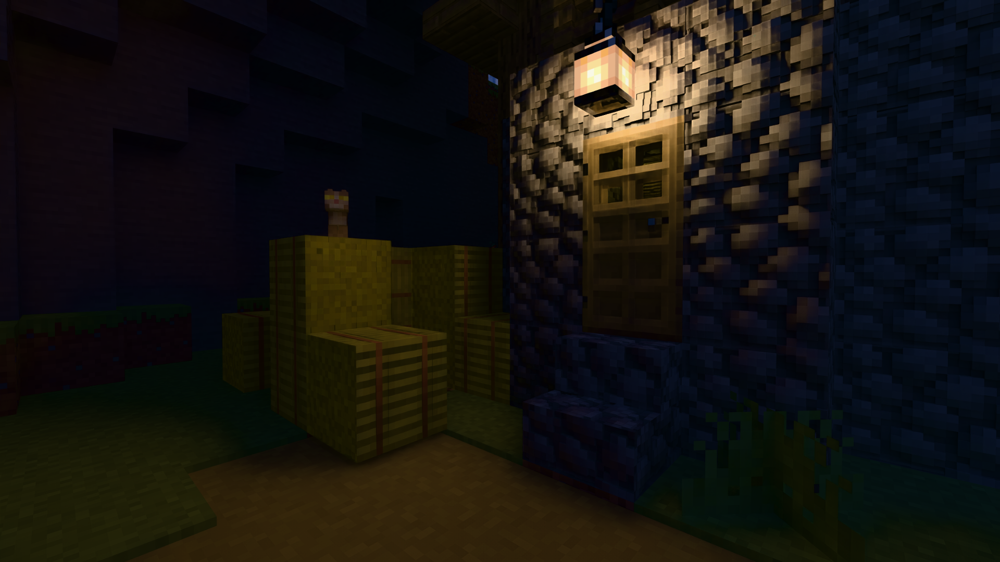
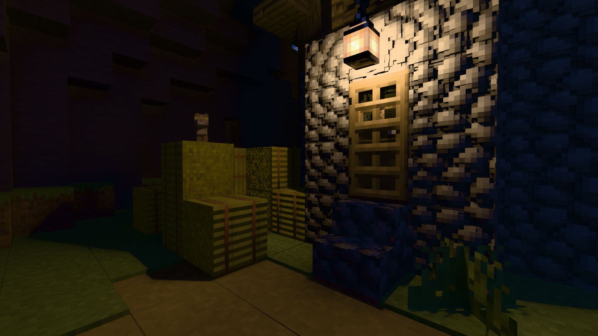
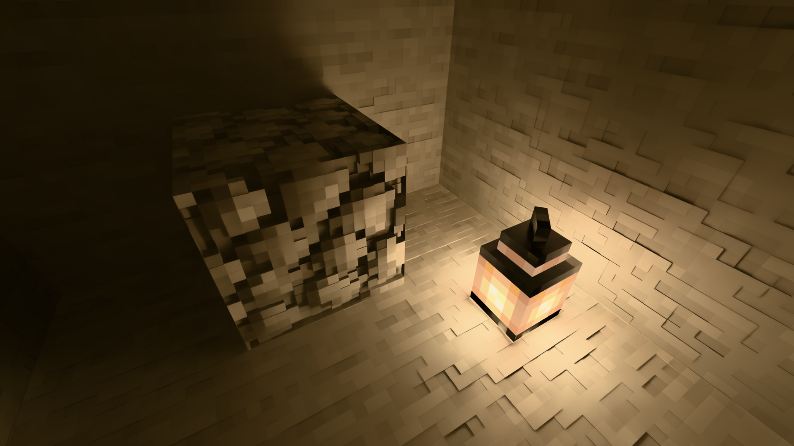
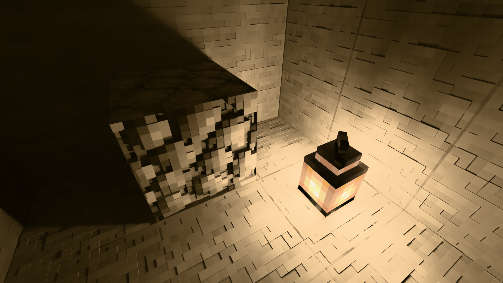
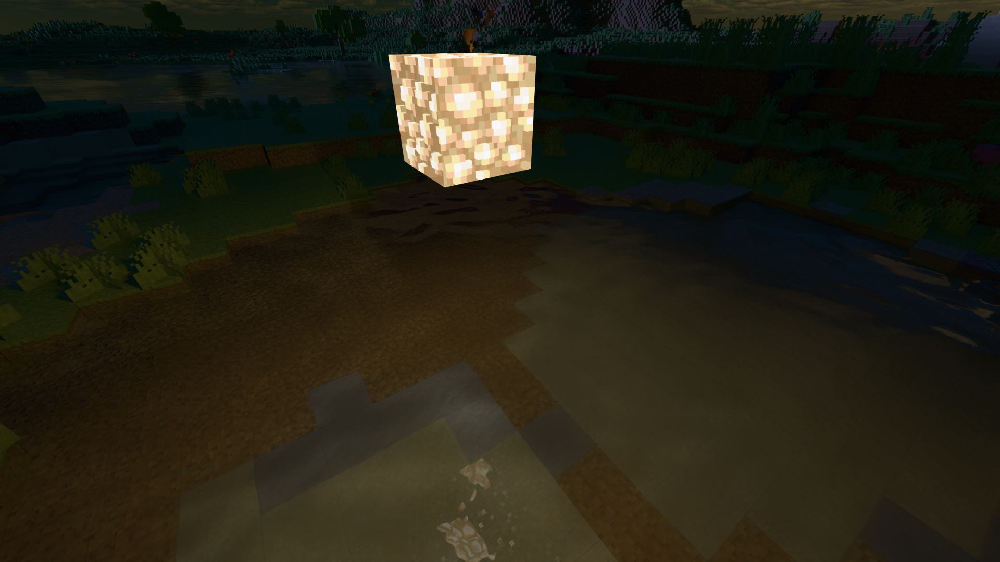

# Shaderpack Advanced

This pack is developed based on the [Vanilla PT](https://github.com/Minecraft-Radiance/Shaderpack-Vanilla-PT) Shaderpack and therefore includes all its features, with enhancements.

# Feature Gallery

The used texture pack is [SPBR](https://modrinth.com/resourcepack/spbr).

## Pure Path Tracing vs. ReSTIR DI enabled

### Village Scene

**Pure Path Tracing**

**ReSTIR DI**

### Parallax

**Pure Path Tracing**

**ReSTIR DI**

## Water Caustic

If ReSTIR is enabled, light source can also generate caustic effect.

